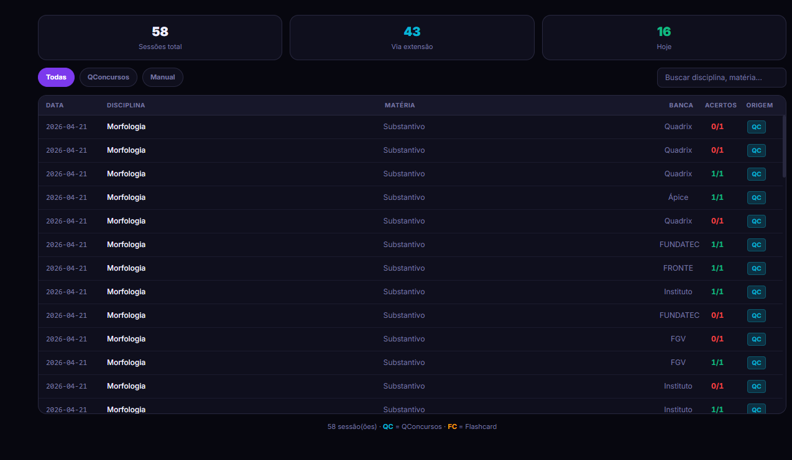
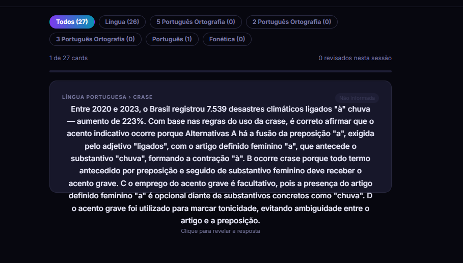
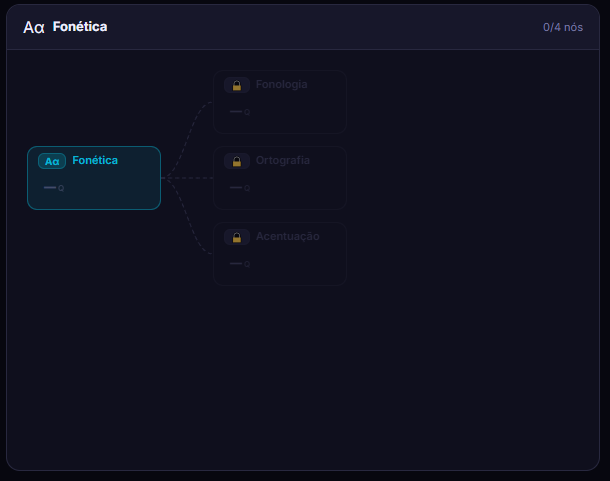

# StudyBI ⚔️

> Plataforma web gamificada de preparação para concursos públicos brasileiros.  
> Log de sessões, análise de performance, flashcards com SRS, diário de operações e sistema de progressão militar.

Desenvolvida para candidatos a cargos de Analista de TI em Tribunais (TSE, TRE, TJ, TCU), focada em bancas como **FGV, CESPE/CEBRASPE, FCC, VUNESP e Quadrix**.

---

## Sumário

- [Visão Geral](#visão-geral)
- [Screenshots](#screenshots)
- [Funcionalidades](#funcionalidades)
- [Tech Stack](#tech-stack)
- [Arquitetura](#arquitetura)
- [Pré-requisitos](#pré-requisitos)
- [Setup](#setup)
- [Schema do Banco de Dados](#schema-do-banco-de-dados)
- [Estrutura do Projeto](#estrutura-do-projeto)
- [Sistema de Gamificação](#sistema-de-gamificação)
- [Variáveis de Ambiente](#variáveis-de-ambiente)
- [Scripts](#scripts)

---

## Visão Geral

O StudyBI resolve um problema específico do concurseiro de TI: **perda de controle sobre o que foi estudado, o que foi errado e o que precisa de revisão** — com motivação que cai sem estrutura de metas e recompensas.

O app adota uma metáfora militar: cada sessão de estudo é uma missão, cada disciplina é uma frente de batalha, e o progresso é medido em patentes (de Recruta a General). O objetivo é transformar a rotina de estudos em algo mensurável, visualizável e motivador.

---

## Screenshots

| Histórico de sessões | Flashcards |
|---|---|
|  |  |

| Árvore de Habilidades |
|---|
|  |

---

## Funcionalidades

### Dashboard
- **KPI por matéria** — taxa de acerto, volume e tendência por disciplina/matéria
- **Mapa de Frentes** — grid visual das disciplinas colorido por situação: verde (consolidada >70%), amarelo (instável 50–70%), vermelho (sob pressão <50%)
- **Alerta de Vulnerabilidade** — badge pulsante para frentes com baixo acerto ou inatividade prolongada, configurável
- **Heatmap anual** — células diárias coloridas por volume; células douradas para dias de Elite (≥80% de acerto e ≥10 questões)
- **Operação do Dia** — define um objetivo diário com nome, meta de questões, countdown até meia-noite e barra de progresso segmentada
- **GoalCard com Patente** — barra de progresso para a meta anual + patente militar atual

### Registrar
- Registro manual de sessões por disciplina, matéria, banca, acertos e total
- Classificação do tipo de erro: não sabia, distração, pegadinha, tempo
- Configuração de disciplinas e matérias personalizadas
- Importação via extensão do QConcursos

### Análise
- Gráficos de performance por disciplina e matéria
- Evolução temporal de acertos
- Comparativo entre bancas

### Histórico
- Tabela paginada de todas as sessões com filtros (origem QC, manual, flashcard) e busca por disciplina/matéria
- Badges de origem por sessão

### Flashcards
- CRUD de cartões por disciplina e matéria
- Revisão espaçada (SRS): intervalos calculados localmente com base em rating (1=Difícil, 2=Normal, 3=Fácil)
- Fila de cards vencidos priorizada
- Filtros por disciplina e busca

### Matérias
- Gerenciador de disciplinas e matérias do usuário
- Lista de bancas ativas

### Diário de Operações
- Log diário com 3 campos obrigatórios: o que atacou, o que resistiu, o que precisa de reforço
- Entrada de hoje em destaque com borda verde
- Contador de streak de dias consecutivos
- Histórico consultável com busca full-text
- Armazenado no Supabase com upsert por `user_id + date`

### Relatório Semanal
- KPIs da semana com delta vs semana anterior (questões, acerto, dias ativos, disciplinas)
- Comparativo de frentes: barras antes/depois por matéria
- Top 3 melhores e piores performances da semana
- Tabela por disciplina
- Grid de 7 dias com indicador de meta e dias de Elite

### Personagem
- Árvore de habilidades por disciplina → matéria
- Nós desbloqueados conforme você estuda aquela matéria
- Visualização em grafo com conexões dependentes

### Sala de Conquistas
36 conquistas em 7 categorias com 4 raridades (Comum, Raro, Épico, Lendário):

| Categoria | Exemplos |
|---|---|
| 💣 Volume de Combate | Primeira Missão (1q) → General das Armas (5.000q) |
| 🎯 Precisão | Atirador Calibrado (70%+) → Perfeição Tática (90%+) |
| 🔥 Sequência | Presença Confirmada (3d) → Inquebrável (30d consecutivos) |
| 📊 Sessões | Primeiro Contato → Lenda Operacional (250 sessões) |
| 🗺️ Frentes | Explorador (3 matérias) → Senhor da Batalha (15 matérias) |
| ⚡ Ofensiva Diária | Dia de Ataque (20q/dia) → Operação Relâmpago (100q/dia) |
| ⭐ Força de Elite | Batismo de Fogo (1 dia elite) → Legião Imortal (25 dias) |

Além das conquistas globais, cada **disciplina individualmente** tem progressão de Volume, Precisão e Sessões — com barra de progresso para o próximo tier.

**Medalhas por Matéria**: Menção Honrosa (70%/15q), Medalha de Mérito (80%/25q), Cruz de Guerra (90%/40q).

---

## Tech Stack

| Camada | Tecnologia |
|---|---|
| UI | React 18 + TypeScript |
| Build | Vite 6 |
| Estilização | Tailwind CSS 3 (tema militar light customizado) |
| Estado | Zustand v5 (slices: auth, sessions, config, flashcards, ui) |
| Roteamento | react-router-dom v7 (HashRouter) |
| Gráficos | Chart.js 4 + react-chartjs-2 |
| Backend/DB | Supabase (PostgreSQL + Auth + Realtime) |
| Backend próprio | Go (opcional, para endpoints de disciplinas e personagem) |

---

## Arquitetura

```
Browser
  └── React SPA (HashRouter)
        ├── Zustand Store (estado global)
        │     ├── authSlice        → userId, signIn, signOut
        │     ├── sessionsSlice    → sessions[], sessionStats[], addSession, removeSession
        │     ├── configSlice      → config (metas), bancas, disc, skillTree, character
        │     ├── flashcardsSlice  → flashcards[], addFlashcard, updateFlashcard
        │     └── uiSlice          → toast, loading flags
        │
        ├── Supabase Client (chamadas diretas ao banco)
        │     ├── sessions         → inserir/listar sessões
        │     ├── user_config      → salvar metas do usuário
        │     ├── flashcards       → CRUD de cartões
        │     ├── diary_entries    → CRUD de diário
        │     └── skill_tree       → carregar árvore de habilidades
        │
        └── Backend Go (opcional, VITE_BACKEND_URL)
              └── /v1/disciplines  → salvar mapa disc → matérias
```

### Fluxo de dados

1. `App.tsx` inicializa o Supabase Auth e carrega sessões, config e flashcards no store via `onAuthStateChange`
2. Componentes consomem o store via `useStore(s => s.campo)` com seletores primitivos (sem object spread para evitar re-renders infinitos)
3. Hooks derivados (`useStats`, `useMedals`, `useAchievements`, `useRank`) calculam métricas via `useMemo` sobre `sessionStats`
4. Escrita no banco acontece otimisticamente: atualiza o store imediatamente e reverte em caso de erro

---

## Pré-requisitos

- **Node.js** >= 18
- **npm** >= 9
- Conta no **Supabase** (free tier é suficiente)
- (Opcional) **Go** >= 1.22 para o backend próprio

---

## Setup

### 1. Clone e instale as dependências

```bash
git clone https://github.com/seu-usuario/study-bi.git
cd study-bi
npm install
```

### 2. Configure as variáveis de ambiente

```bash
cp .env.example .env.local
```

Edite `.env.local`:

```env
VITE_SUPABASE_URL=https://SEU-PROJETO.supabase.co
VITE_SUPABASE_ANON_KEY=sua-anon-key-aqui

# Opcional — backend Go para gerenciar disciplinas/personagem
VITE_BACKEND_URL=http://localhost:8080
```

As chaves estão em **Supabase → Project Settings → API**.

### 3. Configure o banco de dados

Cole os SQLs abaixo no **SQL Editor** do Supabase, na ordem indicada.

#### 3.1 Tabela de sessões

```sql
create table sessions (
  id          text primary key,
  user_id     uuid references auth.users not null,
  ts          bigint not null,
  date        text not null,
  disc        text not null,
  mat         text not null,
  total       int not null default 0,
  correct     int not null default 0,
  banca       text not null default '',
  source      text,
  error_type  text,
  created_at  timestamptz default now()
);

alter table sessions enable row level security;
create policy "users own sessions" on sessions
  for all using (auth.uid() = user_id);
```

#### 3.2 Configurações de metas

```sql
create table user_config (
  user_id   uuid primary key references auth.users,
  daily     int not null default 30,
  weekly    int not null default 200,
  monthly   int not null default 500,
  big_goal  int not null default 1000
);

alter table user_config enable row level security;
create policy "users own config" on user_config
  for all using (auth.uid() = user_id);
```

#### 3.3 Flashcards

```sql
create table flashcards (
  id         text primary key,
  user_id    uuid references auth.users not null,
  ts         bigint not null,
  disc       text not null,
  mat        text not null,
  q          text not null,
  a          text not null,
  banca      text not null default '',
  reviews    jsonb not null default '[]',
  created_at timestamptz default now()
);

alter table flashcards enable row level security;
create policy "users own flashcards" on flashcards
  for all using (auth.uid() = user_id);
```

#### 3.4 Diário de Operações

```sql
create table diary_entries (
  id         uuid primary key default gen_random_uuid(),
  user_id    uuid references auth.users not null,
  date       text not null,
  atacou     text not null default '',
  resistiu   text not null default '',
  reforco    text not null default '',
  created_at timestamptz default now(),
  updated_at timestamptz default now(),
  unique(user_id, date)
);

alter table diary_entries enable row level security;
create policy "users own diary" on diary_entries
  for all using (auth.uid() = user_id);
```

#### 3.5 Árvore de Habilidades

```sql
create table skill_tree (
  id        serial primary key,
  data      jsonb not null,
  version   text not null default '1.0',
  created_at timestamptz default now()
);
```

Depois importe o seed:

```bash
# Cole o conteúdo de seed_skill_tree.sql no SQL Editor do Supabase
```

### 4. Rode o projeto

```bash
npm run dev
```

Acesse `http://localhost:5173`. O app redireciona para a tela de login; crie uma conta com e-mail e senha.

---

## Schema do Banco de Dados

```
auth.users          (gerenciado pelo Supabase Auth)
├── sessions        user_id FK, date, disc, mat, total, correct, banca, source, error_type
├── user_config     user_id PK, daily, weekly, monthly, big_goal
├── flashcards      user_id FK, disc, mat, q, a, banca, reviews (JSONB)
├── diary_entries   user_id FK, date (UNIQUE com user_id), atacou, resistiu, reforco
└── skill_tree      data (JSONB com a árvore completa), version
```

### Modelo de `sessions`

| Campo | Tipo | Descrição |
|---|---|---|
| `id` | text PK | UUID gerado no frontend |
| `user_id` | uuid FK | Usuário dono da sessão |
| `date` | text | `YYYY-MM-DD` |
| `disc` | text | Disciplina (ex: `"Morfologia"`) |
| `mat` | text | Matéria (ex: `"Substantivo"`) |
| `total` | int | Total de questões na sessão |
| `correct` | int | Acertos na sessão |
| `banca` | text | Banca examinadora |
| `source` | text? | `"QConcursos"`, `"flashcard"` ou `null` (manual) |
| `error_type` | text? | `"nao_sabia"`, `"distracao"`, `"pegadinha"`, `"tempo"` |

### Modelo de `flashcards` — campo `reviews` (JSONB)

```json
[
  { "ts": 1714000000000, "rating": 2, "nextDue": 1714086400000 },
  { "ts": 1714086400000, "rating": 3, "nextDue": 1714345600000 }
]
```

`rating`: 1 = Difícil (reaparece em 1 dia), 2 = Normal (3 dias), 3 = Fácil (7 dias).

---

## Estrutura do Projeto

```
study-bi/
├── public/
├── src/
│   ├── components/
│   │   ├── analise/          # Gráficos de análise de performance
│   │   ├── dashboard/        # Dashboard principal e todos os widgets
│   │   │   ├── AchievementGallery.tsx   # Sala de conquistas (36 conquistas + medalhas)
│   │   │   ├── BancaPanel.tsx           # Análise por banca
│   │   │   ├── BattleMap.tsx            # Mapa de Frentes visual
│   │   │   ├── Dashboard.tsx            # Componente raiz do dashboard
│   │   │   ├── DashboardCharts.tsx      # Gráficos (DailyChart, DiscChart)
│   │   │   ├── DailyRing.tsx            # Anel de progresso diário
│   │   │   ├── GoalCard.tsx             # Card de meta anual + patente
│   │   │   ├── Heatmap.tsx              # Heatmap anual com células de Elite
│   │   │   ├── KpiPanel.tsx             # KPIs por matéria
│   │   │   ├── OperationMode.tsx        # Operação do Dia com countdown
│   │   │   ├── RankBadge.tsx            # Badge de patente + modal de promoção
│   │   │   ├── StatCard.tsx             # Card de estatística única
│   │   │   ├── TopSubjects.tsx          # Top matérias por volume
│   │   │   └── VulnAlert.tsx            # Alertas de vulnerabilidade
│   │   ├── diario/           # Diário de Operações
│   │   ├── flashcards/       # CRUD e revisão de flashcards
│   │   ├── historico/        # Tabela de histórico de sessões
│   │   ├── layout/           # Header com navegação
│   │   ├── materias/         # Gerenciador de disciplinas e bancas
│   │   ├── personagem/       # Árvore de habilidades (PersonagemV2)
│   │   ├── registrar/        # Formulário de registro de sessão
│   │   └── relatorio/        # Relatório semanal + tabela histórica
│   │
│   ├── hooks/
│   │   ├── useAchievements.ts  # 36 conquistas globais + conquistas por disciplina
│   │   ├── useMedals.ts        # Medalhas por matéria + dias de Elite
│   │   ├── useRank.ts          # Sistema de patentes militares
│   │   └── useStats.ts         # Estatísticas agregadas (streak, totais, semana, mês)
│   │
│   ├── lib/
│   │   ├── backendApi.ts       # Cliente HTTP para o backend Go (com auth JWT)
│   │   ├── skillTreeData.ts    # Estrutura da árvore de habilidades (hardcoded)
│   │   ├── supabase.ts         # Instância do cliente Supabase
│   │   ├── srs.ts              # Algoritmo de revisão espaçada
│   │   ├── constants.ts        # TIPS motivacionais, constantes globais
│   │   └── utils.ts            # Helpers de data, formatação
│   │
│   ├── store/
│   │   ├── index.ts            # Criação do store Zustand (merge de slices)
│   │   ├── types.ts            # Interface AppState completa
│   │   ├── defaults.ts         # DEFAULT_CONFIG, DEFAULT_DISC, DEFAULT_BANCAS
│   │   ├── toastStore.ts       # Store separado para toasts (evita re-renders globais)
│   │   └── slices/
│   │       ├── authSlice.ts      # Autenticação e carregamento inicial de dados
│   │       ├── sessionsSlice.ts  # CRUD de sessões com sync Supabase
│   │       ├── configSlice.ts    # Metas, bancas, disciplinas, personagem
│   │       ├── flashcardsSlice.ts
│   │       └── uiSlice.ts
│   │
│   ├── types/
│   │   └── index.ts            # Interfaces TypeScript (Session, Flashcard, DiaryEntry…)
│   │
│   ├── App.tsx                 # Root: AuthGate + inicialização do store
│   ├── router.tsx              # Rotas (HashRouter)
│   ├── index.css               # Variáveis CSS, animações, scrollbar
│   └── main.tsx
│
├── .env.example
├── seed_skill_tree.sql         # SQL de seed da árvore de habilidades
├── BACKEND_API.md              # Especificação dos endpoints do backend Go
├── tailwind.config.js
├── tsconfig.json
└── vite.config.ts
```

---

## Sistema de Gamificação

### Patentes Militares

Baseadas no percentual da meta anual (`big_goal`) atingido:

| Patente | % da meta | Insígnia |
|---|---|---|
| Recruta | 0% | ☆ |
| Cabo | 5% | ✦ |
| Sargento | 15% | ✦✦ |
| Tenente | 30% | ★ |
| Capitão | 50% | ★✦ |
| Major | 65% | ★★ |
| Coronel | 80% | ★★✦ |
| General | 100% | ★★★ |

Ao subir de patente, um modal de promoção é exibido com animação. A patente anterior é gravada em `localStorage` para detectar upgrades.

### Força de Elite

Dias em que o usuário atinge simultaneamente **≥80% de acerto** e **≥10 questões** são marcados como dias de Elite. Aparecem como células douradas no heatmap. Os thresholds são configuráveis na interface.

### Medalhas por Matéria

Para cada matéria individualmente, calculadas sobre todo o histórico:

| Medalha | Acerto mínimo | Questões mínimas |
|---|---|---|
| Menção Honrosa | 70% | 15q |
| Medalha de Mérito | 80% | 25q |
| Cruz de Guerra | 90% | 40q |

### Conquistas por Disciplina

Além das 36 conquistas globais, cada disciplina tem seus próprios slots de progressão para Volume (questões resolvidas nessa disc), Precisão (acerto nessa disc) e Sessões (sessões nessa disc) — com os mesmos tiers das conquistas globais.

---

## Variáveis de Ambiente

| Variável | Obrigatória | Descrição |
|---|---|---|
| `VITE_SUPABASE_URL` | Sim | URL do projeto Supabase |
| `VITE_SUPABASE_ANON_KEY` | Sim | Chave pública (anon) do Supabase |
| `VITE_BACKEND_URL` | Não | URL do backend Go (padrão: `http://localhost:8080`) |

> O arquivo `.env.local` não deve ser commitado. Ele está no `.gitignore`.

---

## Scripts

```bash
npm run dev      # Servidor de desenvolvimento (http://localhost:5173)
npm run build    # Build de produção (tsc + vite build) → dist/
npm run preview  # Preview do build de produção
```

### Build para produção

```bash
npm run build
```

O output vai para `dist/`. Como o roteamento usa `HashRouter`, o arquivo pode ser servido por qualquer CDN ou hosting estático (Vercel, Netlify, GitHub Pages) sem configuração de redirect.

---

## Notas de Desenvolvimento

### Padrão de seletores Zustand

Sempre use seletores primitivos — nunca retorne objetos literais em `useStore`:

```ts
// CORRETO — um seletor por campo
const userId  = useStore(s => s.userId)
const config  = useStore(s => s.config)

// ERRADO — cria novo objeto a cada render → loop infinito
const { userId, config } = useStore(s => ({ userId: s.userId, config: s.config }))
```

### Dados derivados

Métricas calculadas (streak, acerto global, conquistas) devem usar `useMemo` sobre `sessionStats` (versão leve de `sessions`, sem campos de UI). Nunca derive métricas diretamente de `sessions` completo para evitar re-renders desnecessários.

### RLS no Supabase

Todas as tabelas usam **Row Level Security** com políticas `auth.uid() = user_id`. O cliente Supabase injeta o JWT automaticamente em cada request a partir do `onAuthStateChange` configurado em `App.tsx`.
